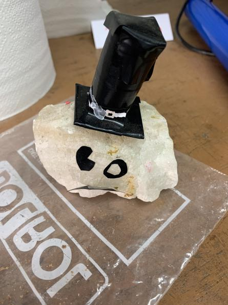

# Bob_Must_Have_Its_Hat
**Equipo:** 11

**Integrantes:**

* Monroy Salazar Diego Gustavo - Manager & Artist
* Ventura Ricárdez Jeremy - Music 
* Muriel González Diego - Coder

**Semestre:** 2023-2

**Torre de niveles:** 1

## **Introducción:**
Proyecto de juego 2D tipo Endless Runner creado por alumnos de la FI UNAM para SODVI para subir en la torre de niveles
e introducirnos en el mundo de desarrollo de videojuegos.

## **Descripción del proyecto:**

Una vez formado el equipo nos reunimos en línea para hacer lluvia de ideas. Primero planteamos cada uno algún juego y discutimos la complejidad y la posibilidad de hacer cada uno de ellos, considerando que eramos primerisos en el desarrollo de videojuegos tuvimos que descartar varias ideas. Finalmente optamos por un juego tipo Endless Runner debido a la simplicidad de su desarrollo, pero necesitabamos dejar nuestra marca y no solo hacer un clon del dinosaurio de Google. Fue así como vino a nuestra mente Bob, la mascota de la asosiación y la inspiración de este juego. 

Durante el desarrollo del juego se nos ocurrian nuevas ideas, pero también surgian nuevos problemas. Nuestro artista decidió no colaborar más y esto tuvo un gran impacto en el desarrollo del juego. Tuvimos que recortar la idea de animaciones y otras cosas de arte, y por poco cortamos la tienda. 

Conforme se acercaron la fecha de entrega tuvimos que recortar más cosas como mecanicas del juego y los powerups, ya que no funcionaban correctamente. Fuimos puliendo errores y la experiencia del juego en general.

 
 
 
 

  

## **Conclusión:** 

- Monroy Salazar Diego Gustavo: Fue un gran reto hacerla de manager sin experiencia previa ya que no creí poder manejar un equipo entero...y por surte estaba equivocado. Creo que pude haber hecho mejor al principio del desarrollo y mejorar la forma de trabajar. Mi parte favorita fue trabajar en equipo y conocer cosas y conceptos nuevos, mi parte menos favorita fue tomar la desición de recortar contenido que teníamos planeado. Sin embargo considero que aprendí mucho de mis errores y aciertos de este proyecto, pienso que como manager y como equipo supimos adaptarnos a las circunstancias y a la partida de uno de nuestros compañeros. No podría estar más satisfecho con este primer proyecto y con el equipo que tuve.

- Ventura Ricárdez Jeremy: Sinceramente nunca creí participar en la creación de un juego y menos como músico. Al principio no tenía muy claro cómo desempeñar mi rol y realmente no teníamos una idea del todo clara de cómo sería la música del juego. Pero conforme las reuniones en equipo fueron pasando e ibamos prototipando nuestro juego todo iba quedando más claro. Aprendí muchísimo de esta experiencia, creo que es uno de los puntos importantes de la creación de videojuegos es importante para desarrollar muchísimos avances en la vida diaria, desarrolla habilidades motoras, así mismo nunca espere trabajar en este tipo de proyecto era algo que veía muy lejano, aprendí mucho acerca de música y como debía darle desarrollo a los videojuegos definitivamente ha sido una de las mejores experiencias, mi equipo fue muy unido y pudimos lograr más de lo que esperábamos.

- Muriel González Diego: Desde que supe que sería Coder sabía que gran parte del trabajo caería sobre mí, era un gran reto que no sabía si podría lograr ya que nunca había participado en un juego y menos programarlo. Ahora que hemos terminado el proyecto siento una gran satisfacción de haberlo logrado. Fue muy difícil al principio pero rápidamente fuí adaptandome y aprendiendo nuevas cosas. Era un constante trabajo de pensar en cómo hacer algo o re pensarlo completamente de nuevo. Estoy muy feliz con el resultado final.

<!-- Cuando entregues tu documentación, por favor, borra todo lo que esté debajo. -->

 
 
 
 

  

<h3 align="center">Documentado por Monroy Salazar Diego Gustavo y Muriel González Diego</h3>

